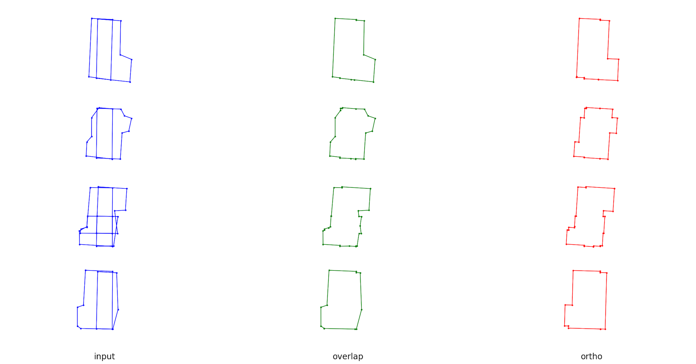

# GeoGremlin
Bunch of geo related stuff.

- makes polygons orthogonal 
- resolves geometries overlaps
- download tiles from wms based on shape
- etc.

### Install

Install only vector dependencies:
```bash
# vector only
pip install "geo-gremlin[vector]"

# raster only
pip install "geo-gremlin[raster]"

# CLI tools
pip install "geo-gremlin[cli]"

# all in
pip install "geo-gremlin[vector,raster,cli]"
```

If you need GDAL-based helpers (like `run_gdal_retiling`, `gdal_imread`), install GDAL in two steps:
1. Install system GDAL separately (for example via `brew` on macOS or `conda`).
2. Install Python bindings with the same version as your system GDAL to avoid ABI/version mismatch:

### CLI scripts
TBD

### API
#### Vector operations

<details>
<summary><code>orthogonalize(...)</code></summary>

```python
orthogonalize(
    gdf: gpd.GeoDataFrame,
    *,
    n_workers: int = 6,
    verbose: bool = False,
) -> gpd.GeoDataFrame
```

Orthogonalize all polygon geometries in a GeoDataFrame. It is a batch wrapper over `orthogonalize_poly`, with optional multiprocessing.

```python
from geo_gremlin.vector.ortho import orthogonalize

ortho_gdf = orthogonalize(overlap_gdf, n_workers=1, verbose=False)
```

Parameters:
- `gdf`: `gpd.GeoDataFrame`, input GeoDataFrame with polygon geometries.
- `n_workers`: `int`, number of worker processes (`1` runs sequentially).
- `verbose`: `bool`, show progress bars when `True`.
</details>

<!-- <details> -->
<!-- <summary><code>orthogonalize_poly(...)</code></summary> -->

<!-- ```python -->
<!-- orthogonalize_poly( -->
<!--     poly: Polygon, -->
<!-- ) -> Polygon -->
<!-- ``` -->

<!-- Orthogonalize a single polygon by generating several proposals and keeping the one with better IoU to the original. -->

<!-- ```python -->
<!-- from geo_gremlin.vector.ortho import orthogonalize_poly -->

<!-- ortho_poly = orthogonalize_poly(poly) -->
<!-- ``` -->

<!-- Parameters: -->
<!-- - `poly`: `Polygon`, shapely polygon to orthogonalize. -->
<!-- </details> -->

</br>

<details>
<summary><code>resolve_overlaps(...)</code></summary>

```python
resolve_overlaps(
    gdf: gpd.GeoDataFrame,
    mode: ResolveMode = "union",
    verbose: bool = False,
    **params,
) -> gpd.GeoDataFrame
```

Resolve intersecting polygons in a GeoDataFrame by grouping overlaps and merging them using a selected mode.

```python
from geo_gremlin.vector.overlap import resolve_overlaps

overlap_gdf = resolve_overlaps(test_gdf, mode="union", verbose=False)
```

Parameters:
- `gdf`: `gpd.GeoDataFrame`, input GeoDataFrame with polygon geometries.
- `mode`: `ResolveMode`, merge strategy: `"union"`, `"intersection"`, `"largest"`, or `"iou_select"`.
- `verbose`: `bool`, show progress bars when `True`.
- `**params`: extra params for mode-specific behavior (`iou_threshold` for `"iou_select"`).
</details>

</br>

<!-- <details> -->
<!-- <summary><code>PolyVizConfig(...)</code></summary> -->

<!-- ```python -->
<!-- PolyVizConfig( -->
<!--     poly: Polygon, -->
<!--     color: str, -->
<!--     enumerate_vert: bool = True, -->
<!-- ) -->
<!-- ``` -->

<!-- Small config object for drawing one polygon with matplotlib. -->

<!-- ```python -->
<!-- from geo_gremlin.vector.vis import PolyVizConfig -->

<!-- pc = PolyVizConfig(poly=poly, color="red", enumerate_vert=False) -->
<!-- ``` -->

<!-- Parameters: -->
<!-- - `poly`: `Polygon`, polygon to draw. -->
<!-- - `color`: `str`, matplotlib-compatible color. -->
<!-- - `enumerate_vert`: `bool`, draw vertex indices when `True`. -->
<!-- </details> -->

<!-- <details> -->
<!-- <summary><code>GdfVizConfig(...)</code></summary> -->

<!-- ```python -->
<!-- GdfVizConfig( -->
<!--     gdf: gpd.GeoDataFrame, -->
<!--     color: str, -->
<!--     title: str | None = None, -->
<!--     enumerate_vert: bool = True, -->
<!-- ) -->
<!-- ``` -->

<!-- Config object for drawing all geometries from one GeoDataFrame. Handy for `plot_gdf` and `subplot_gdf`. -->

<!-- ```python -->
<!-- from geo_gremlin.vector.vis import GdfVizConfig -->

<!-- cfg = GdfVizConfig(test_gdf, "blue", "input", False) -->
<!-- ``` -->

<!-- Parameters: -->
<!-- - `gdf`: `gpd.GeoDataFrame`, GeoDataFrame to visualize. -->
<!-- - `color`: `str`, matplotlib-compatible color. -->
<!-- - `title`: `str | None`, optional subplot title. -->
<!-- - `enumerate_vert`: `bool`, draw vertex indices when `True`. -->
<!-- </details> -->

<!-- <details> -->
<!-- <summary><code>plot_polygons(...)</code></summary> -->

<!-- ```python -->
<!-- plot_polygons( -->
<!--     polys: list[PolyVizConfig], -->
<!--     fig_fn: str | Path, -->
<!--     *, -->
<!--     fig_size: tuple[int, int] | None = None, -->
<!-- ) -> None -->
<!-- ``` -->

<!-- Plot polygons on one figure and save it. If you need side-by-side panels, use `subplot_polygons`. -->

<!-- ```python -->
<!-- from geo_gremlin.vector.vis import PolyVizConfig, plot_polygons -->

<!-- plot_polygons( -->
<!--     polys=[PolyVizConfig(poly, "red", enumerate_vert=False)], -->
<!--     fig_fn="archive/figs/poly.png", -->
<!--     fig_size=(8, 8), -->
<!-- ) -->
<!-- ``` -->

<!-- Parameters: -->
<!-- - `polys`: `list[PolyVizConfig]`, polygon configs to draw. -->
<!-- - `fig_fn`: `str | Path`, output image path. -->
<!-- - `fig_size`: `tuple[int, int] | None`, figure size in inches (`(10, 10)` by default). -->
<!-- </details> -->

<!-- <details> -->
<!-- <summary><code>plot_gdf(...)</code></summary> -->

<!-- ```python -->
<!-- plot_gdf( -->
<!--     gdf_config: GdfVizConfig, -->
<!--     fig_fn: str | Path, -->
<!--     *, -->
<!--     fig_size: tuple[int, int] | None = None, -->
<!-- ) -> None -->
<!-- ``` -->

<!-- Plot one GeoDataFrame config and save it. This is a convenience wrapper over `plot_polygons`. -->

<!-- ```python -->
<!-- from geo_gremlin.vector.vis import GdfVizConfig, plot_gdf -->

<!-- plot_gdf( -->
<!--     gdf_config=GdfVizConfig(test_gdf, "blue", "input", False), -->
<!--     fig_fn="archive/figs/input.png", -->
<!--     fig_size=(10, 10), -->
<!-- ) -->
<!-- ``` -->

<!-- Parameters: -->
<!-- - `gdf_config`: `GdfVizConfig`, what to plot and how. -->
<!-- - `fig_fn`: `str | Path`, output image path. -->
<!-- - `fig_size`: `tuple[int, int] | None`, figure size in inches. -->
<!-- </details> -->

<!-- <details> -->
<!-- <summary><code>subplot_polygons(...)</code></summary> -->

<!-- ```python -->
<!-- subplot_polygons( -->
<!--     polys_per_plot: list[list[PolyVizConfig]], -->
<!--     fig_fn: str | Path, -->
<!--     titles: list[str | None], -->
<!--     *, -->
<!--     fig_size: tuple[int, int] | None = None, -->
<!--     borders: bool = True, -->
<!-- ) -> None -->
<!-- ``` -->

<!-- Plot several polygon groups as side-by-side subplots, useful for before/after comparisons. -->

<!-- ```python -->
<!-- from geo_gremlin.vector.vis import PolyVizConfig, subplot_polygons -->

<!-- subplot_polygons( -->
<!--     polys_per_plot=[[PolyVizConfig(poly_a, "blue")], [PolyVizConfig(poly_b, "red")]], -->
<!--     fig_fn="archive/figs/compare.png", -->
<!--     titles=["a", "b"], -->
<!--     fig_size=(16, 8), -->
<!--     borders=False, -->
<!-- ) -->
<!-- ``` -->

<!-- Parameters: -->
<!-- - `polys_per_plot`: `list[list[PolyVizConfig]]`, one list of polygons per subplot. -->
<!-- - `fig_fn`: `str | Path`, output image path. -->
<!-- - `titles`: `list[str | None]`, title per subplot. -->
<!-- - `fig_size`: `tuple[int, int] | None`, figure size in inches. -->
<!-- - `borders`: `bool`, hide axes when `False`. -->
<!-- </details> -->

<!-- <details> -->
<!-- <summary><code>subplot_gdf(...)</code></summary> -->

<!-- ```python -->
<!-- subplot_gdf( -->
<!--     gdf_configs: list[GdfVizConfig], -->
<!--     fig_fn: str | Path, -->
<!--     *, -->
<!--     fig_size: tuple[int, int] | None = None, -->
<!--     borders: bool = True, -->
<!-- ) -> None -->
<!-- ``` -->

<!-- Plot several GeoDataFrames in side-by-side subplots. This wraps `subplot_polygons`. -->

<!-- ```python -->
<!-- from geo_gremlin.vector.vis import GdfVizConfig, subplot_gdf -->

<!-- subplot_gdf( -->
<!--     [ -->
<!--         GdfVizConfig(test_gdf, "blue", "input", False), -->
<!--         GdfVizConfig(overlap_gdf, "green", "overlap", False), -->
<!--         GdfVizConfig(ortho_gdf, "red", "ortho", False), -->
<!--     ], -->
<!--     "archive/figs/demo.png", -->
<!--     fig_size=(30, 15), -->
<!--     borders=False, -->
<!-- ) -->
<!-- ``` -->

<!-- Parameters: -->
<!-- - `gdf_configs`: `list[GdfVizConfig]`, configs to draw. -->
<!-- - `fig_fn`: `str | Path`, output image path. -->
<!-- - `fig_size`: `tuple[int, int] | None`, figure size in inches. -->
<!-- - `borders`: `bool`, hide axes when `False`. -->
<!-- </details> -->

<!-- <details> -->
<!--   <summary>Toggle to see example image</summary> -->

<!--   <p align="left"> -->
<!--      -->
<!--   </p> -->
<!-- </details> -->


Check [demo_vector.py](./examples/demo_vector.py).

#### Raster ops
TBD

### Dev
For dev dependencies check [requirements.txt](./requirements.txt).
